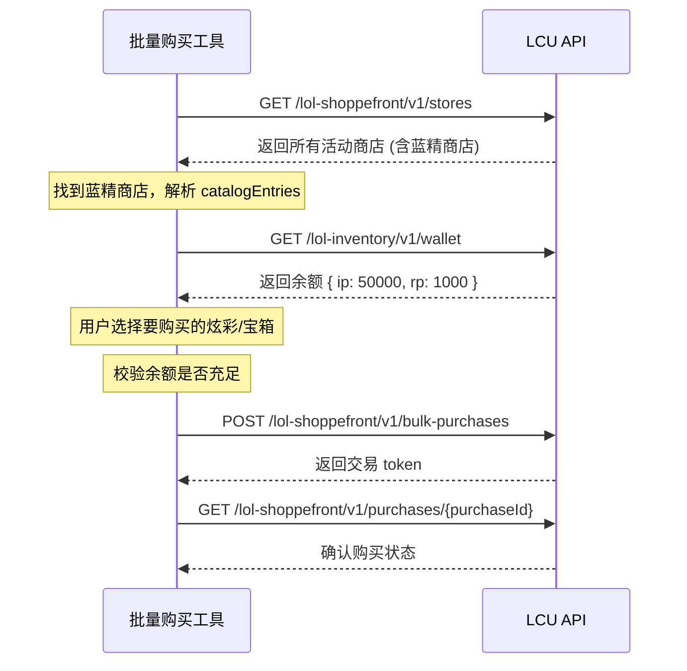

# LCU API 蓝色精粹商店（Blue Essence Emporium）接口调研

## 结论概览

> [!IMPORTANT]
> LCU API 文档中**存在**可用于蓝色精粹商店批量购买炫彩/战利品宝箱的接口，但有**两套不同的 API 体系**可选用。

---

## 一、相关 API 接口汇总

### 1. 商品列表获取

#### 方案 A：`lol-store`（经典商店 API）

| 接口 | 说明 |
|------|------|
| `GET /lol-store/v1/catalog` | 获取商店完整目录，支持按 `inventoryType` 和 `itemId` 过滤 |
| `GET /lol-store/v1/catalog/{inventoryType}` | 按物品类型获取目录（如 `CHAMPION`, `CHAMPION_SKIN` 等） |

- **炫彩 (Chroma)**：`inventoryType` 为 `"CHROMA"` 或通过 `subInventoryType` 识别
- 每个 `LolStoreCatalogItem` 包含 `prices` 数组：
  ```json
  {
    "inventoryType": "string",
    "itemId": 0,
    "subInventoryType": "string",
    "prices": [
      { "cost": 2000, "currency": "IP", "discount": 0 }
    ],
    "active": true,
    "tags": []
  }
  ```
- 蓝色精粹在 LCU 中的货币标识为 `"IP"`

#### 方案 B：`lol-shoppefront`（新商城 API，即 ChemtechShoppe）

| 接口 | 说明 |
|------|------|
| `GET /lol-shoppefront/v1/stores` | 获取所有活动商店（蓝精商店在活动期间会出现在此列表中） |
| `GET /lol-shoppefront/v1/stores/{shoppefrontId}` | 获取指定商店详情 |

- 每个商店包含 `catalogEntries`，每个 entry 有 `purchaseUnits` → `paymentOptions` → `payments`
  ```json
  {
    "id": "store-id",
    "name": "Blue Essence Emporium",
    "catalogEntries": [{
      "id": "entry-id",
      "name": "Chroma Name",
      "purchaseUnits": [{
        "paymentOptions": [{
          "key": "payment-option-key",
          "payments": [{ "currencyId": "lol_blue_essence", "delta": 2000 }]
        }]
      }]
    }]
  }
  ```

#### 炫彩查询（补充）

| 接口 | 说明 |
|------|------|
| `GET /lol-champions/v1/inventories/{summonerId}/champions/{championId}/skins/{skinId}/chromas` | 获取某皮肤的所有炫彩列表 |

返回包含 `ownership.owned`、`stillObtainable`、`colors` 等字段。

---

### 2. 战利品/宝箱相关

| 接口 | 说明 |
|------|------|
| `GET /lol-loot/v1/player-loot` | 获取玩家当前拥有的所有战利品 |
| `GET /lol-loot/v1/loot-items` | 获取战利品物品定义列表 |
| `POST /lol-loot/v1/recipes/{recipeName}/craft` | 使用战利品配方合成（如开箱） |
| `POST /lol-loot/v1/craft/mass` | 批量合成 |

> [!NOTE]
> 战利品宝箱如果在蓝精商店以蓝色精粹购买，本质上是通过商店购买（`lol-store` 或 `lol-shoppefront`），购买后宝箱会出现在 `lol-loot` 的 `player-loot` 中。开箱则使用 `recipes/{recipeName}/craft`。

---

### 3. 购买接口

#### 方案 A：`lol-store` 传统购买

| 接口 | 说明 |
|------|------|
| `POST /lol-store/v3/purchase` | 购买商店物品 |

```json
// Request Body
[
  { "inventoryType": "CHROMA", "itemId": 12345, "quantity": 1, "rpCost": 0 }
]

// Response
{
  "ipBalance": 8000,
  "rpBalance": 5000,
  "transactions": [{ "id": "...", "inventoryType": "CHROMA", "itemId": 12345 }]
}
```

#### 方案 B：`lol-shoppefront` 新商城购买

| 接口 | 说明 |
|------|------|
| `POST /lol-shoppefront/v1/purchases` | 单个购买 |
| `POST /lol-shoppefront/v1/bulk-purchases` | **批量购买** ⭐ |

```json
// 批量购买 Request Body
{
  "purchaseItems": [
    {
      "catalogEntryId": "entry-id-1",
      "paymentOptions": ["payment-option-key"],
      "quantity": 1,
      "storeId": "store-id"
    },
    {
      "catalogEntryId": "entry-id-2",
      "paymentOptions": ["payment-option-key"],
      "quantity": 1,
      "storeId": "store-id"
    }
  ],
  "purchaseTimeOut": 30000
}
```

#### 方案 C：`lol-purchase-widget` 购买组件

| 接口 | 说明 |
|------|------|
| `POST /lol-purchase-widget/v2/purchaseItems` | 通过购买组件购买 |
| `POST /lol-purchase-widget/v3/purchaseOffer` | 通过 Offer 购买 |

```json
// purchaseItems Request Body
{
  "items": [{
    "itemKey": { "inventoryType": "CHROMA", "itemId": 12345 },
    "purchaseCurrencyInfo": { "currencyType": "IP", "price": 2000, "purchasable": true },
    "quantity": 1
  }]
}
```

---

### 4. 余额查询

| 接口 | 说明 |
|------|------|
| `GET /lol-inventory/v1/wallet` | 获取钱包余额（`ip` = 蓝色精粹, `rp` = 点券） |
| `GET /lol-store/v1/status` | 商店状态 |

---

## 二、推荐实现方案

> [!TIP]
> 建议**优先使用 `lol-shoppefront` 体系**，因为它提供了原生的 `bulk-purchases` 批量购买接口，且是 Riot 新商城（ChemtechShoppe）的底层 API。

### 批量购买流程



### 备选方案（传统 lol-store）

如果 `lol-shoppefront` 不返回蓝精商店数据，可回退到传统 `lol-store` API：
1. `GET /lol-store/v1/catalog?inventoryType=CHROMA` 获取炫彩列表
2. 循环调用 `POST /lol-store/v3/purchase` 逐个购买

---

## 三、关键注意事项

> [!WARNING]
> - 蓝色精粹商店是**限时活动**，API 只在活动期间才有对应的商店数据
> - `inventoryType` 的具体值（如 `CHROMA`、`LOOT`）需在活动期间通过实际 API 调用确认
> - `lol-shoppefront` 是较新的 API（ChemtechShoppe），不确定蓝精商店是否已经迁移至此

> [!CAUTION]
> 由于蓝精商店当前可能正在开放，建议先在客户端启动时调用以下接口确认：
> 1. `GET /lol-shoppefront/v1/stores` — 看是否有蓝精商店
> 2. `GET /lol-store/v1/catalog` — 看是否有 IP 价格的炫彩/战利品
